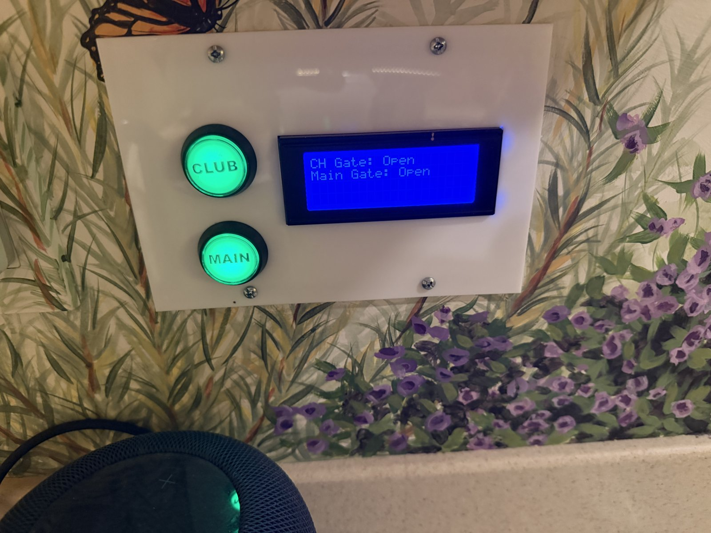

# Gate Panel — Unifi Access/Protect edition



The control panel (buttons, LCD, NeoPixels) talks to Home Assistant, which
talks to Unifi Access/Protect. Two different transports are used for the two
directions, deliberately:

```
[Button press] --local HTTP POST--> [HA webhook] --switch.turn_on/off--> [Unifi Protect relay]

[Unifi Access binary_sensor changes] --HA automation--> [POST to Particle Cloud] --Particle.subscribe()--> [LCD + NeoPixel update]
```

**Button -> gate** goes over a local webhook (plain HTTP, LAN only, matching
the `local_only: true` pattern your Home Assistant config already uses
elsewhere). There's no simple way for Home Assistant to receive a push from
the Particle Cloud without extra infrastructure, so this direction stays
local.

**Gate state -> panel** goes through the Particle Cloud, the same way the
original two-Photon setup worked — Home Assistant just publishes the event
that used to come from the second Photon. This needed no local HTTP server on
the Photon at all (removed entirely), no static/reserved IP for it either,
and reuses the exact `Particle.subscribe()` code path already proven on this
hardware.

## What was found in your Home Assistant config

From the backup you shared, these are the entities already set up by your
Unifi Access / Unifi Protect integrations:

| Purpose | Entity |
|---|---|
| Main gate relay (control) | `switch.main_gate_relay_output_djb_gate_output` |
| Clubhouse gate relay (control) | `switch.clubhouse_gate_relay_output_gate_relay` |
| Main gate state | `binary_sensor.gate` (device_class `door`: `on` = open, `off` = closed) |
| Clubhouse gate state | `binary_sensor.clubhouse_gate` (same convention) |

Your config also already uses `local_only: true` webhook-triggered automations
for a couple of other things (e.g. "Unlock E-shop", "Landscape Lights"), which
is what the button-press direction here follows.

## Setup steps

1. **Create a Particle access token for Home Assistant.** Recommended:
   Particle console > your project > Access Tokens (or "API Users" under
   team settings) to create a token scoped to just the event-publish API,
   set to never expire. If you'd rather use the CLI:
   ```
   particle token create --never-expires
   ```
   A plain `particle token create` defaults to a 90-day expiration, which
   will silently break the state-push side of this once it lapses — avoid
   that unless you're going to rotate it deliberately.

2. **Add the token to Home Assistant's `secrets.yaml`:**
   ```yaml
   particle_auth_header: "Bearer YOUR_TOKEN_HERE"
   ```

3. **Create the local firmware config.** Copy `src/ha-config.h.example` to
   `src/ha-config.h` and set `HA_HOST` to your Home Assistant's local IP or
   hostname (this is only used for the outbound button-press webhooks).
   `src/ha-config.h` is gitignored, so your address stays out of the repo and
   never shows up as an uncommitted change. Building without it fails with a
   message telling you to create it.

4. **Flash the Photon** with `particle flash <device> .` from the project root.
   The libraries (`LiquidCrystal_I2C_Spark`, `clickButton`, `neopixel`) are
   declared in `project.properties`, so they're pulled in automatically.

5. **Add the Home Assistant config:**
   - Merge `homeassistant/rest_commands_gate_panel.yaml` into your
     `rest_command:` block (or `configuration.yaml`).
   - Merge the automations from `homeassistant/automations_gate_panel.yaml`
     into your `automations.yaml`.
   - Reload automations (Developer Tools > YAML > Reload Automations) and
     restart Home Assistant so the new `rest_command` is picked up.

6. **Test each direction independently before trusting it on a real gate:**

   Button -> gate (simulate from a machine on your LAN):
   ```
   curl -X POST http://<HA_HOST>:8123/api/webhook/gatepanel-main-open-bJC4yulP6XuuD1jopP0Q
   ```
   Watch `switch.main_gate_relay_output_djb_gate_output` in HA to confirm it
   flipped.

   State -> panel (simulate a push from HA, using the same request HA's
   automation makes):
   ```
   curl https://api.particle.io/v1/devices/events \
     -H "Authorization: Bearer YOUR_TOKEN_HERE" \
     -d name=main_gate_state -d data=open -d private=true
   ```
   Watch the LCD/NeoPixel update. You can also watch the event arrive live
   with `particle subscribe main_gate_state --all` from the CLI.

   Then power-cycle the Photon and confirm it requests current state on boot
   (LCD should go from "DUNNO" to the real state within a few seconds of the
   Photon reconnecting to the Particle Cloud).

## Notes / things worth knowing

- **The webhook IDs are effectively secrets on your LAN.** `local_only: true`
  keeps them unreachable from the internet, but anyone on your Wi-Fi who
  knows an ID could hit it. That matches the trust model of your existing
  webhook automations, but worth being aware of.
- **Button behavior:** each button now sends an explicit open or close
  command based on the gate's last known real state (from Unifi Access),
  defaulting to "open" if state is still unknown (e.g. right after boot,
  before the first state push arrives). This replaces the old panel's local
  toggle guess, which didn't have any ground truth to check itself against.
- **Pending-state feedback.** A gate takes a while to swing, so between the
  press and the confirming state push there used to be no feedback at all --
  the button kept showing the *old* state and looked like nothing had
  happened. Now pressing a button starts a "pending" state for that gate: its
  pixel blinks slowly red/green (600ms each) and the LCD reads
  `Opening`/`Closing` until Home Assistant reports the state you actually
  asked for, at which point it goes solid. An intermediate or contrary report
  leaves it blinking. If the gate never confirms, `PENDING_TIMEOUT_MS` (90s)
  gives up and falls back to the last known state rather than blinking
  forever. Pressing again while pending just restarts the timer.
- **Dropped the old "skip counter" digit** that appeared in the corner of the
  LCD in the previous firmware — that was specific to the old
  Photon-to-Photon protocol and doesn't have an equivalent concept in the
  Unifi Access data, so it's gone rather than faked.
- **Fire-and-forget outbound webhook calls.** The Photon doesn't wait for or
  parse Home Assistant's response to a button press — if the call fails
  (Wi-Fi hiccup, HA down), the press is silently dropped rather than retried.
  Given this is a manual panel a person is standing in front of, that seemed
  reasonable (they'll just press it again), but say if you'd rather have
  retry logic or an error indicator on the panel.
- **Token expiration is the main long-term maintenance item here** — if you
  didn't use `--never-expires` or an API User token, the state-push direction
  will quietly stop working when the token lapses (the button-press direction
  is unaffected, since it doesn't use the Particle Cloud at all).
- Kept `Particle.variable()`s for `mainGateState` and `clubGateState` so you
  can sanity-check the device from the Particle console/CLI without needing
  physical access.
